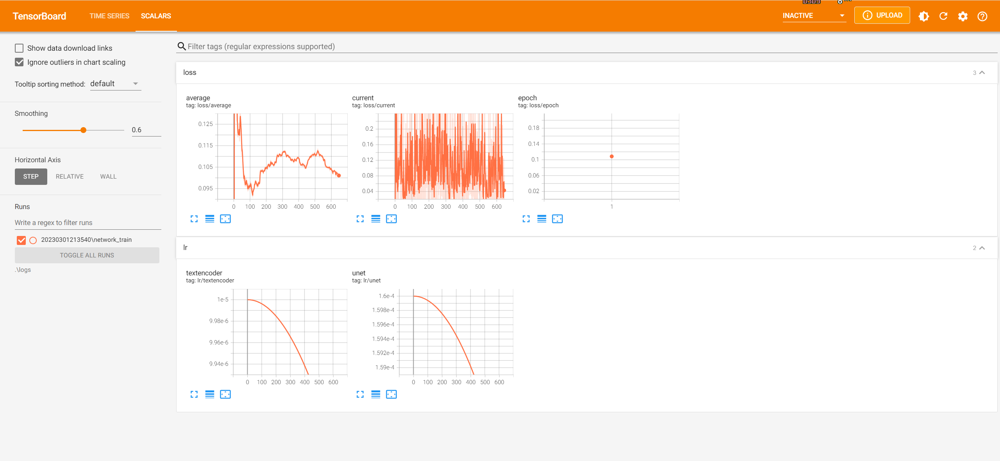

# LoRA-scripts

LoRA training scripts for [kohya-ss/sd-scripts](https://github.com/kohya-ss/sd-scripts.git)

✨NEW: Train GUI


Follow the installation guide below to install the GUI, then run `run_gui.ps1` or `run_gui.sh` to start the GUI. 


## Usage

### Clone repo with submodules

```sh
git clone --recurse-submodules https://github.com/Akegarasu/lora-scripts
```

### Required Dependencies

Python 3.10.8 and Git

### Windows

#### Installation

Run `install.ps1` will automaticilly create a venv for you and install necessary deps.

#### Train

Edit `train.ps1`, and run it.

### Linux

#### Installation

Run `install.bash` will create a venv and install necessary deps.

#### Train

Training script `train.sh` **will not** activate venv for you. You should activate venv first.

```sh
source venv/bin/activate
```

Edit `train.sh`, and run it.

#### TensorBoard

Run `tensorboard.ps1` will start TensorBoard at http://localhost:6006/


